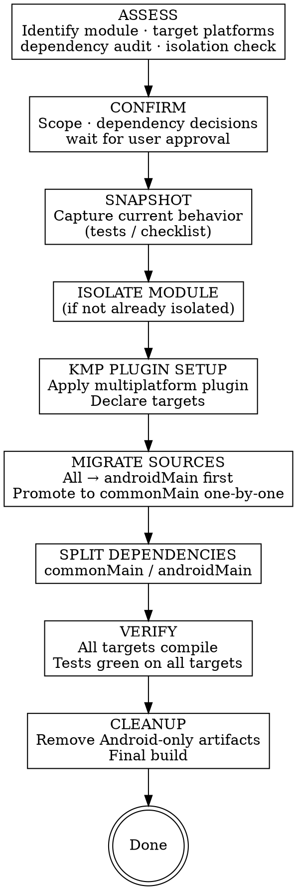

# KMP Migration

## Overview

**Core principle:** Assess what can move to common → audit dependency compatibility → isolate module → migrate sources to the right source sets → verify on all targets → clean up Android-only artifacts.

KMP migration is a structural change, not just a library swap. It changes how the project is compiled, how source files are organized, and which dependencies are visible to which targets. The key constraint: code in `commonMain` must compile without any Android SDK — the Kotlin compiler enforces this strictly.

Never start moving sources before the dependency audit is done. A dependency that has no KMP artifact will block `commonMain` compilation and force you to backtrack.

## When to Use

- User says "move :module to KMP" or "make :domain multiplatform"
- User says "share business logic with iOS" or "share code between Android and iOS"
- User asks about moving code to `commonMain` / `androidMain`
- User asks "is it possible to use KMP without a full rewrite"

## Workflow



## Phase 1: Assess

### 1. Identify the migration target

Read the module(s) the user wants to migrate. Understand:
- What it does (domain logic? data layer? networking? UI?)
- What platforms the user wants to target (Android + iOS? Android + JVM? All?)
- Whether it's already in its own Gradle module

### 2. Check module isolation

**Extraction to a dedicated Gradle module is a hard prerequisite** for KMP migration. Code cannot partially live in `commonMain` — the entire module must be KMP-configured.

- Already isolated → proceed to step 3
- Mixed into a large module → propose isolation as preparation PR before any KMP work. Isolation sequence: extract → `./gradlew :new-module:assemble` green → proceed.

### 3. KMP dependency compatibility audit

For every dependency in the target module(s), verify it has a KMP-compatible artifact. A library that works on Android may fail to compile in `commonMain` — the Kotlin compiler enforces this strictly.

Read `build.gradle.kts` / `build.gradle` and audit each dependency. Use `maven-mcp` tools if available (`scan_project_dependencies` then `check_multiple_dependencies`) — they can tell you the latest version and whether it includes KMP metadata. If unavailable: search Maven Central for `<group>:<artifact>` and look for Kotlin Multiplatform mentions in the README, changelog, or published artifact metadata.

Categorize each dependency:

| Category | Meaning | Action |
|----------|---------|--------|
| **KMP-compatible now** | Current version works in `commonMain` | Move to `commonMain.dependencies` |
| **KMP available, minor update** | Newer minor version adds KMP support | Bump version, move to `commonMain.dependencies` |
| **KMP only in breaking major** | KMP support exists but requires a major version with API changes (e.g. Coil 2→3, Room 2→2.7 alpha) | Treat as a **nested migration** — use `maven-mcp:dependency-changes` to assess effort; plan as a separate PR before or alongside KMP work |
| **No KMP support** | No KMP artifact exists at any version | Must either: find a KMP alternative (Retrofit → Ktor, Hilt → Koin), keep the code in `androidMain` behind `expect`/`actual`, or drop it |

**Present the compatibility matrix to the user before Phase 2.** Each "breaking major" or "no support" entry changes the migration scope. The user must decide for each:
- Migrate the dependency as a pre-step (separate PR)
- Include it in scope
- Keep it in `androidMain` only
- Drop it

Do not absorb these decisions silently — they affect effort, risk, and strategy.

### 4. Propose strategy options

Based on the audit, propose 1–3 options. Be opinionated. Format:

> **Option A — [name]** ⭐ recommended
> Preparation: [module isolation if needed, nested dependency migrations]
> Migration: [how sources move — all at once or layer by layer]
> PRs: [e.g., "PR 1: isolation, PR 2: dependency updates, PR 3: source set migration, PR 4: cleanup"]
> Effort: low / medium / high
> Risk: low / medium / high
> Why: [1–2 sentences tied to what you found]

Dismiss strategies that don't fit with a reason — don't silently omit them.

### 5. After user approves — generate migration checklist

If scope involves >1 file group or nested dependency migrations:
- One row per unit: name, source set destination, dependency changes, snapshot method
- **Present to user — wait for approval before Phase 2**

### Bug Discovery Rule (applies in ALL phases)

Found a bug while reading or migrating code?
1. Stop immediately
2. Describe the bug to the user
3. State whether the migration would fix it, expose it, or is unrelated
4. Ask: fix now / create separate task / leave as-is
5. **Never silently fix or ignore bugs found during migration**

## Phase 2: Snapshot

Capture current behavior **before touching any code**.

### Behavior Specification

Produce a `behavior-spec.md` for each module being migrated:

```markdown
# Behavior Specification: [ModuleName]
Migrating to KMP — targets: [Android / iOS / JVM]

## Public Interface
| Class / Function | Inputs | Output / Side Effect | Notes |
|---|---|---|---|

## Normal Behaviors
- [description of each significant behavior]

## Edge Cases
- [inputs at boundaries, empty collections, zero]

## Platform Assumptions (things that may need expect/actual)
- [any behavior that currently relies on Android SDK implicitly]

## Out of Scope
- [behaviors that will intentionally change]
```

**Present the spec to the user before Phase 3.**

### Logic tests

Write characterization tests in `commonTest` where possible (so they run on all targets), or `androidUnitTest` for Android-specific paths:
- Pin actual inputs/outputs including edge cases, nullability, error paths
- For async code: use `runBlocking { }` or `runTest { }` (kotlinx-coroutines-test)
- Run all tests — all must pass before Phase 3

**Hard rule:** Phase 3 does NOT start until Snapshot is complete and green.

## Phase 3: Migrate

### Step 1 — Module isolation (if needed as preparation)

If the module is mixed into a larger module:
1. Extract to `:module-name` Gradle module
2. `./gradlew :module-name:assemble` — must be green
3. Commit as a standalone PR before any KMP changes

### Step 2 — Apply KMP plugin

In `build.gradle.kts`, replace `id("com.android.library")` + `id("org.jetbrains.kotlin.android")` with the multiplatform plugin:

```kotlin
plugins {
    alias(libs.plugins.kotlin.multiplatform)
    alias(libs.plugins.android.library)  // keep this for Android target
}

kotlin {
    androidTarget {
        compilations.all {
            kotlinOptions { jvmTarget = "17" }
        }
    }
    // Add other targets as needed:
    // iosArm64(); iosSimulatorArm64(); iosX64()
    // jvm()
}

android {
    // android config stays here unchanged
}
```

Run `./gradlew :module:assemble` — must stay green before touching any source files.

### Step 3 — Source directory restructure

**Source set directories:**
```
src/
  commonMain/kotlin/   ← platform-agnostic code (pure Kotlin, no Android SDK)
  androidMain/kotlin/  ← Android-specific (anything using android.*, Context, Activity, etc.)
  iosMain/kotlin/      ← iOS-specific implementations (if targeting iOS)
  commonTest/kotlin/   ← shared tests
  androidUnitTest/kotlin/
```

**Migration sequence — the safest path:**

1. **Move everything to `androidMain` first** — rename `src/main/kotlin` → `src/androidMain/kotlin`. The build stays green because nothing has changed logically.
2. **Split dependencies** (Step 4).
3. **Promote files to `commonMain` one by one** — for each file, move it, then fix compilation errors:
   - Android imports that fail in `commonMain` → either extract behind `expect`/`actual` or leave in `androidMain`
   - Files that can't be fully de-Androidified → keep in `androidMain`; expose an interface from `commonMain`

**What belongs where:**

| `commonMain` | `androidMain` |
|---|---|
| Domain models, data classes | Anything importing `android.*` or `androidx.*` |
| Business logic, use cases | Context, Activity, Fragment usage |
| Repository interfaces | Room implementations |
| Pure utility classes | Hilt modules / DI setup |
| Coroutines logic | Platform-specific engines (Ktor Android engine) |
| Serialization models | Android-specific networking configs |

**`expect` / `actual` pattern** — for code that needs different implementations per platform:

```kotlin
// commonMain
expect fun currentTimeMillis(): Long

// androidMain
actual fun currentTimeMillis(): Long = System.currentTimeMillis()

// iosMain
actual fun currentTimeMillis(): Long = NSDate().timeIntervalSince1970.toLong() * 1000
```

Use `expect`/`actual` sparingly — only when the behavior genuinely differs per platform. Prefer moving platform dependencies behind an interface and injecting them.

### Step 4 — Split dependencies

Replace the flat `dependencies {}` block with source-set-scoped blocks inside `kotlin { sourceSets { } }`:

```kotlin
kotlin {
    // targets declared above...

    sourceSets {
        commonMain.dependencies {
            // KMP-compatible artifacts only
            implementation(libs.kotlinx.coroutines.core)
            implementation(libs.kotlinx.serialization.json)
            implementation(libs.ktor.client.core)
            implementation(libs.koin.core)           // if replacing Hilt
        }
        androidMain.dependencies {
            // Android-specific engines and wrappers
            implementation(libs.ktor.client.android)
            implementation(libs.androidx.core.ktx)
            implementation(libs.koin.android)
        }
        commonTest.dependencies {
            implementation(libs.kotlin.test)
            implementation(libs.kotlinx.coroutines.test)
        }
    }
}
```

**Rules for placing a dependency:**
- Pure Kotlin with KMP metadata → `commonMain`
- Wraps Android SDK or uses a platform-specific engine → `androidMain`
- Has both core + engine artifacts (e.g. Ktor) → core artifact in `commonMain`, engine in `androidMain`
- Not sure → run `./gradlew :module:compileCommonMainKotlinMetadata`; if it compiles, it can go in `commonMain`

### Step 5 — Compile checks after each step

```bash
./gradlew :module:compileCommonMainKotlinMetadata   # commonMain compiles alone
./gradlew :module:compileDebugKotlin                # full Android target
./gradlew :module:assemble                          # full module build
```

Run after plugin setup, after each source file promotion, and after dependency split.

Apply **Bug Discovery Rule** throughout (see Phase 1).

## Phase 4: Verify + Cleanup

### Step 1 — Re-run tests

Re-run all Snapshot tests on all targets → all must pass.

```bash
./gradlew :module:testDebugUnitTest          # Android unit tests
./gradlew :module:iosSimulatorArm64Test      # iOS tests (if targeting iOS)
./gradlew :module:jvmTest                    # JVM tests (if targeting JVM)
```

**If tests fail:** stop → diagnose → fix in migrated code, never by weakening or deleting tests.

### Step 2 — Behavior spec review

Walk through `behavior-spec.md` line by line:
- Every public interface entry: same signature or documented intentional change?
- Every normal behavior and edge case: covered by a passing test or manually verified?
- Every platform assumption: handled via `expect`/`actual` or confirmed platform-agnostic?
- **Present completed review to user — wait for confirmation**

### Step 3 — Cleanup

1. Find: old Android-only Gradle deps no longer needed after source set split
2. Find: any `dependencies {}` block that wasn't converted to `sourceSets { }` style
3. Find: dead code or adapter layers made obsolete by the migration
4. **Present full removal list to user — wait for acknowledgment**
5. Remove everything on the list
6. `./gradlew build` — must be green

### Done only when ALL of the following are true:
- [ ] All Snapshot tests pass on all targets
- [ ] Behavior spec reviewed line-by-line — user confirms all behaviors accounted for
- [ ] No remaining `import android.*` in `commonMain`
- [ ] Cleanup list acknowledged and all items removed
- [ ] `./gradlew build` green

## Red Flags — STOP

| Red Flag | What It Means |
|----------|---------------|
| "I'll deal with incompatible dependencies later" | Dependency audit must complete before touching sources |
| "The module isn't isolated but I'll migrate in place" | Module isolation is a hard prerequisite — no exceptions |
| "I'll add tests after the migration" | Snapshot must be green before Phase 3 |
| "It compiled on Android, it's probably fine in commonMain" | Compilation in `commonMain` is stricter — run `compileCommonMainKotlinMetadata` |
| "These old androidMain files are clearly unused" | Present removal list to user first, always |
| "I noticed a bug, I'll fix it quickly" | Stop, describe to user, get explicit direction |
